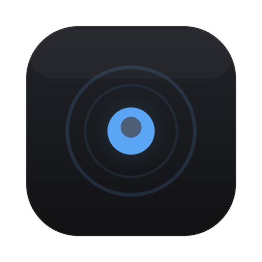

<p align="center">
  
</p>

<h1 align="center">Record</h1>

<p align="center">
  <strong>Know where your time goes.</strong><br />
  Privacy-first activity tracker for macOS.
</p>

<p align="center">
  <a href="https://github.com/Stoffberg/record/actions/workflows/ci.yml"></a>
  
  
  
</p>

Record runs as a background daemon, tracks which apps you use and for how long, stores everything locally in SQLite, and shows daily and monthly breakdowns through a native desktop app. No cloud, no accounts. Your data never leaves your machine.

## Features

- Foreground app tracking with idle detection
- Live-ticking counters (1s frontend interpolation, 5s backend poll)
- Per-app breakdown with native icons, session counts, and progress bars
- Monthly view with daily activity bars
- System tray with show/hide and quit
- Window close hides to tray (keeps tracking in the background)
- Dark and light mode (follows system preference)

## Install

Download the latest `.dmg` from [Releases](https://github.com/Stoffberg/record/releases), open it, and drag Record to Applications.

On first launch, macOS will prompt for Accessibility permission. Grant it so Record can read window titles.

## Develop

```bash
pnpm install
pnpm dev
```

Requires macOS, [Rust](https://rustup.rs/) 1.77+, [Node.js](https://nodejs.org/) 22+, [pnpm](https://pnpm.io/) 10+, and Xcode Command Line Tools.

| Command | What it does |
|---------|-------------|
| `pnpm dev` | Start in development mode (hot reload) |
| `pnpm build` | Production build |
| `pnpm check` | Run everything: lint, typecheck, fmt, clippy, test |
| `pnpm lint` | Biome lint + format check |
| `pnpm test` | Rust tests |
| `pnpm clippy` | Rust linting |

Pre-commit hooks (via [Lefthook](https://github.com/evilmartians/lefthook)) run Biome, rustfmt, and clippy automatically. Install with `lefthook install`.

## Architecture

```
record/
├── apps/
│   └── desktop/             Tauri v2 app
│       ├── src/             Solid.js frontend
│       └── src-tauri/       Rust backend (tracker, store, tray)
├── packages/
│   └── types/               Shared TypeScript interfaces
└── lefthook.yml             Pre-commit hooks
```

Rust backend for memory safety and small footprint during 24/7 uptime. Solid.js frontend for a tiny bundle and reactive primitives. SQLite with WAL mode for local storage. Tauri v2 ties it together as a native macOS app with system tray.

Shared types live in `packages/` so they can be reused later by a CLI, web dashboard, or sync layer.

## How it works

The tracker polls the active window every 5 seconds using `NSWorkspace.frontmostApplication()` and checks idle time via IOKit. Each poll produces a heartbeat. Consecutive heartbeats for the same app get merged into sessions (configurable gap threshold). Sessions are stored in SQLite with RFC3339 timestamps.

The frontend fetches summaries every 5 seconds and interpolates counters at 1 second intervals so everything feels live without hammering the database.

Bundle IDs are resolved by walking the process path up to find the `.app` bundle and reading `CFBundleIdentifier` from `Info.plist`. App icons are extracted from `.icns` files via `sips`, cached on disk and in memory.

## Data

Everything stays in `~/Library/Application Support/dev.stoff.record/`:

| File | Contents |
|------|----------|
| `record.db` | SQLite database with all activity sessions |
| `icon_cache/` | PNG app icons (extracted from system `.icns` files) |

## Roadmap

- [x] Launch at login (autostart on macOS login)
- [x] Onboarding screen with Accessibility permission prompt
- [ ] Click a day in monthly view to see that day's breakdown
- [ ] Data export (JSON/CSV for backup or LLM analysis)
- [ ] App exclusion list (ignore specific apps from tracking)
- [ ] Weekly summary notifications
- [ ] Homebrew cask distribution

## License

MIT
